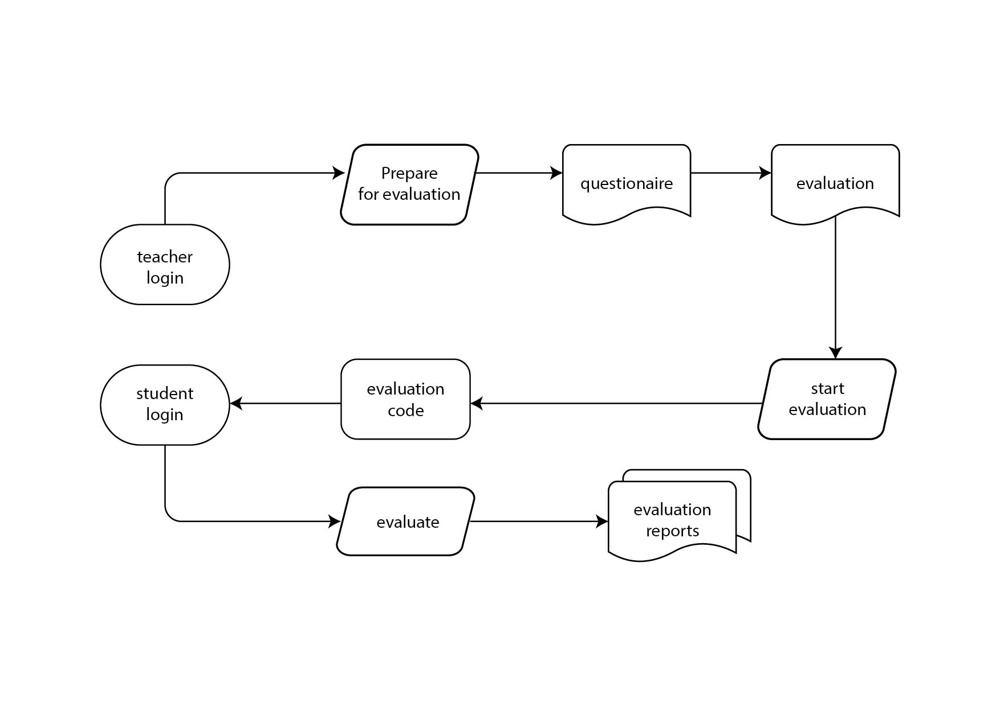
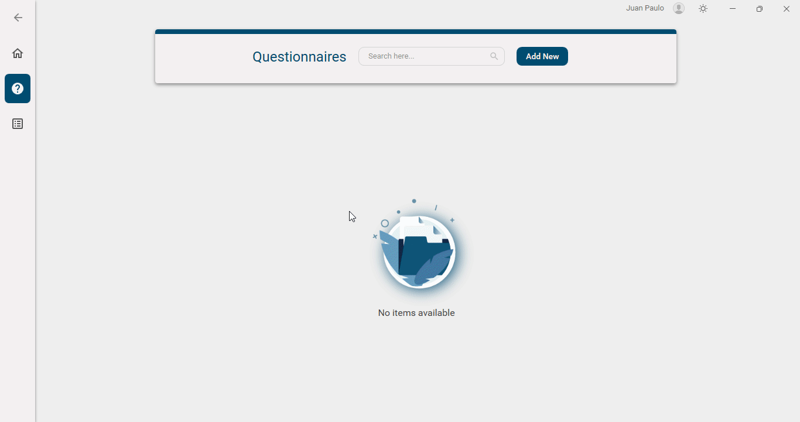

---

### Minimum System Requirements

- Windows 10 or higher
- [.NET 7.0](https://dotnet.microsoft.com/en-us/download/dotnet/7.0)
- [MongoDB Server 6.0](https://www.mongodb.com/try/download/community)
- 1366x768 screen resolution
- 1GB RAM

### Development Stack

- [C#](https://docs.microsoft.com/en-us/dotnet/csharp/) programming language
- Windows Presentation Foundation (WPF) for graphical user interface with Material Design
- ASP.NET Core for web server
- gRPC for client-server communication
- MongoDB, a NoSQL database, for data storage

### Development Environment

- [Visual Studio 2022](https://visualstudio.microsoft.com/vs/preview/) for development
- [Visual Studio Code](https://code.visualstudio.com/) for editing markdown files

### Application Architecture

### Database Schema

### Evaluation Code Generation Flow

### Usage Instructions
* To manage teachers, click the "Manage" button in the top-right corner of the application. Default username and password is "admin".
  
* To manage questionnaires and evaluations, click "Manage" and login as a teacher. The default username is the teacher's full name and password is "user".
  
* To create a questionnaire, switch to "Questionnaires Page", click "Add New" and fill-out the form.
  
* To create an evaluation, select the questionnaire you want to evaluation and click "Create Evaluation" icon.
  
* To start an evaluation, switch to "Evaluation Page", click "Start" icon. The evaluation code will be generated and displayed.
  
* The students can now start the evaluation by entering the evaluation code.
  
* The teacher can view the results of the evaluation by selecting the corresponding evaluation and click "Generate Report" icon to generate excel report.
  